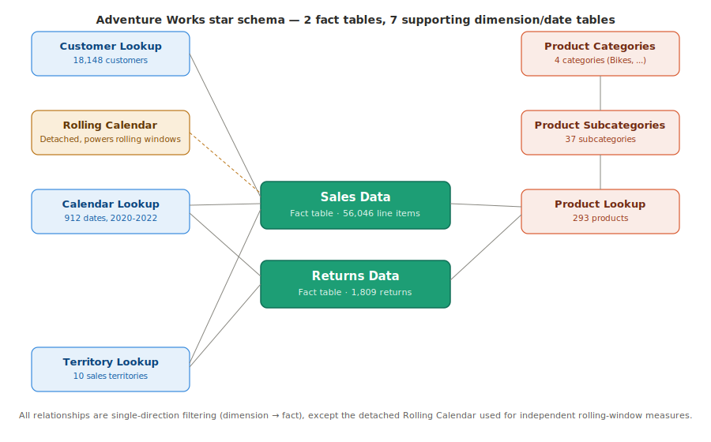
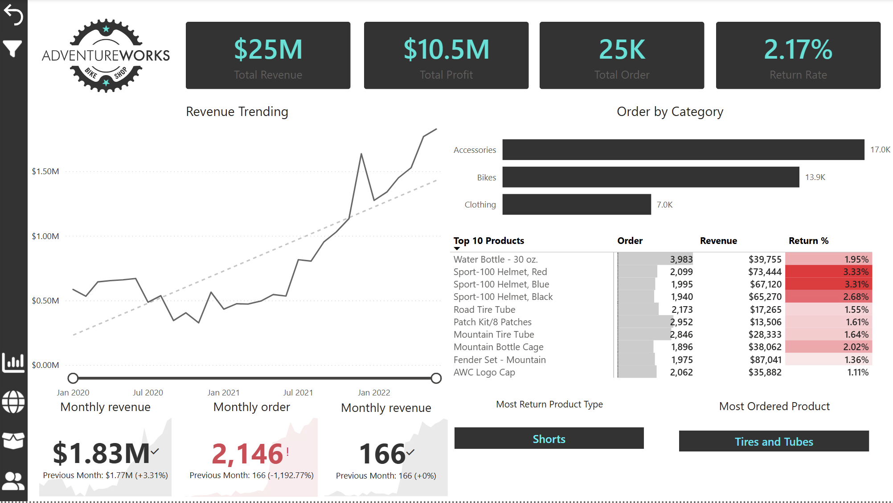
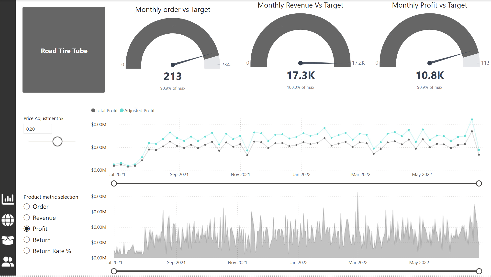
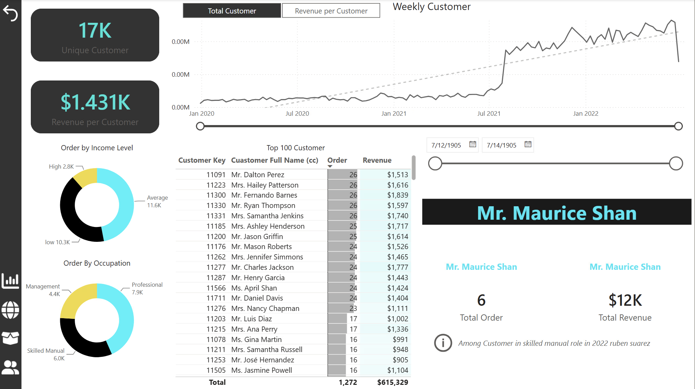
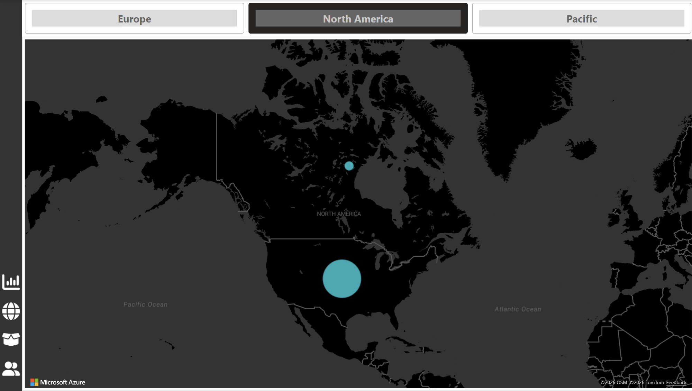

# Adventure Works — Executive Analytics Suite

An end-to-end Power BI solution for Adventure Works, a fictional bicycle manufacturer, covering $24.9M in revenue across 25,164 orders and 17,416 customers (Jan 2020 – Jun 2022).

The goal wasn't just to build reports — it was to think like an analyst: what decision does this visual need to support, and does the model make that decision easy to reach?



## What's in the suite

**Executive Dashboard** — high-level KPIs, revenue trending (10-day and 90-day rolling windows), YTD performance, and top products at a glance.

**Product Analysis** — gauge visuals comparing actuals to a dynamic target (prior month +10% growth), plus a price-elasticity what-if slider that recalculates projected revenue and profit in real time as the price adjustment changes.

**Customer Analysis** — segmentation by income and occupation, drill-through to individual customer profiles, and bookmark-toggled views for switching between summary and detail.

Supporting pages: a territory map view, and a custom tooltip page used across visuals for a more polished hover experience.

## Data model

Star schema with 2 fact tables and 7 supporting tables:

| Table | Type | Rows |
|---|---|---|
| Sales Data | Fact | 56,046 |
| Returns Data | Fact | 1,809 |
| Customer Lookup | Dimension | 18,148 |
| Product Lookup | Dimension | 293 |
| Product Subcategories Lookup | Dimension | 37 |
| Product Categories Lookup | Dimension | 4 |
| Territory Lookup | Dimension | 10 |
| Calendar Lookup | Date | 912 |
| Rolling Calendar | Date (detached) | 1,150 |

The Rolling Calendar is intentionally detached from the model so time-intelligence measures (10-day, 90-day, previous-month) can move independently of whatever filter context the report page is in.

## DAX measures

42 measures, organized by purpose in [`/dax`](./dax):

- [`01-core-sales-measures.dax`](./dax/01-core-sales-measures.dax) — revenue, cost, profit, order/customer counts
- [`02-category-share-measures.dax`](./dax/02-category-share-measures.dax) — Bikes category isolated against total portfolio
- [`03-time-intelligence-measures.dax`](./dax/03-time-intelligence-measures.dax) — YTD, rolling windows, prior-month comparisons
- [`04-target-and-gap-measures.dax`](./dax/04-target-and-gap-measures.dax) — dynamic targets and target-vs-actual gaps (drives the gauges)
- [`05-customer-detail-measures.dax`](./dax/05-customer-detail-measures.dax) — drill-through page guards using `HASONEVALUE`
- [`06-price-simulation-what-if.dax`](./dax/06-price-simulation-what-if.dax) — the what-if price elasticity slider

A couple worth highlighting:

**Dynamic targets instead of hardcoded numbers** — rather than typing in a fixed revenue goal, the target is calculated as last month's actual + 10%:
```dax
Revenue Target = [Previous month revenue] * 1.1
Revenue Target Gap = [Total Revenue] - [Revenue Target]
```
This means the gauges keep working correctly as new months of data land, with no manual updates.

**Price elasticity simulation** — a What-If parameter table drives a slider on the Product Analysis page. Moving it recalculates revenue and profit without touching the underlying Sales Data:
```dax
Price Adjustment % Value = SELECTEDVALUE('Price Adjustment %'[Price Adjustment %], 0)
Adjusted price = [Average Retail Price] * (1 + 'Price Adjustment %'[Price Adjustment % Value])
Adjusted Revenue = SUMX('Sales Data', 'Sales Data'[OrderQuantity] * [Adjusted price])
```


   *Executive Dashboard — KPIs, revenue trending, order/category breakdown, top products*

   
   *Product Analysis — target gauges, price elasticity what-if slider, field parameter metric switcher*

   
   *Customer Analysis — income/occupation segmentation, drill-through customer profiles*

   
   *Territory Map — geographic order distribution across sales regions*

## Tech stack

Power BI Desktop · DAX · Star schema data modeling · What-if parameters · Field parameters · Drill-through & bookmarks

## File structure

```
adventure-works-power-bi/
├── pbix/
│   └── AdventureWorks-Executive-Suite.pbix
├── dax/
│   ├── 01-core-sales-measures.dax
│   ├── 02-category-share-measures.dax
│   ├── 03-time-intelligence-measures.dax
│   ├── 04-target-and-gap-measures.dax
│   ├── 05-customer-detail-measures.dax
│   └── 06-price-simulation-what-if.dax
├── docs/
│   ├── star-schema.svg
└── README.md
```
